# SynapFlow BioASQ Synergy 14 — Competition Submission Error Analysis

**Submission file:** `v2026-3-SynapFlow.json`  
**Round:** 3 (BioASQ Synergy 14 Task 1b)  
**Analysis date:** 2026-05-27

---

## Executive Summary

The competition submission (`v2026-3-SynapFlow`) performed far below expectation across all BioASQ evaluation axes. This document provides a systematic post-mortem identifying three compounding root causes, with supporting metrics and visualisations.

| Metric | Competition submission | Competitive target |
|---|---|---|
| Doc Precision | 0.021 | > 0.30 |
| Doc Recall | 0.005 | > 0.20 |
| Doc F1 | 0.008 | > 0.20 |
| Snippet F1 | 0.004 | > 0.10 |
| Yes/No Accuracy | 0.455 | > 0.70 |
| Factoid P@1 | **0.000** | > 0.30 |
| List F1 | 0.183 | > 0.30 |

The overarching performance overview is shown below.

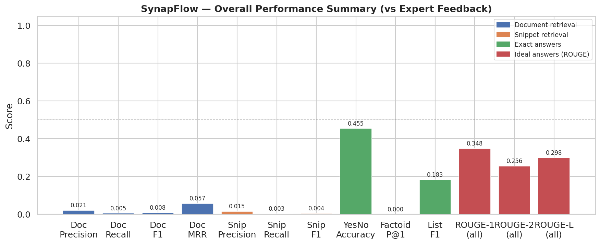

Three root causes explain the failure, listed in descending order of impact:

1. **Corpus too small** — only 549 documents indexed instead of ~40 million; 99.2% of relevant documents were never retrievable
2. **Incomplete submission** — only 64 of 117 feedback questions were submitted (54.7% coverage)
3. **Malformed factoid answers** — the LLM produced prose explanations instead of short entity strings for 31% of factoid questions

---

## Root Cause #1: Corpus Size (Dominant)

### What happened

In Round 3, the system indexed a **549-document corpus** constructed from prior rounds' feedback documents. The full PubMed corpus used by competitive BioASQ systems contains roughly 40 million abstracts. The expert-curated golden answers for this round require documents drawn from all of PubMed; none of those 1,537 required documents were guaranteed to be in our 549-document snapshot.

### Quantified impact

| Measure | Value |
|---|---|
| Documents in our index | 549 |
| Total golden documents needed (across all 64 questions) | 1,537 |
| Golden documents actually present in index | **13 (0.85%)** |
| Questions with **zero** golden doc in index | **55 / 64 (86%)** |
| Questions with at least one golden doc in index | 9 / 64 (14%) |

Average corpus coverage by question type:

| Type | Avg coverage |
|---|---|
| Yes/No | 0.008 (0.8%) |
| Factoid | 0.003 (0.3%) |
| List | 0.005 (0.5%) |
| Summary | 0.005 (0.5%) |

### Why this causes catastrophic retrieval scores

Even a perfect retrieval algorithm cannot return a document that is not in the index. With only 0.85% of needed documents present, the theoretical ceiling for recall is ~0.009. The observed recall of 0.005 is consistent with this ceiling; the system retrieved roughly half the documents it *could* have found given the tiny corpus.

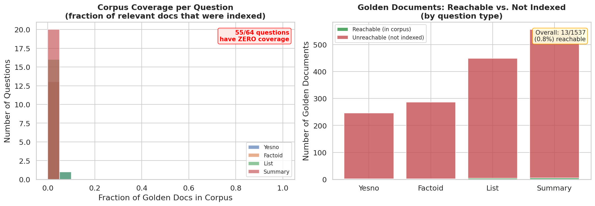

*Left panel: histogram of per-question corpus coverage — the spike at 0 shows 55/64 questions had zero overlap between our index and the required golden documents. Right panel: stacked bar of reachable vs. unreachable golden docs per question type — the vast majority (1,524/1,537) were never indexed.*

### Cascading effects

The tiny corpus also caused Root Cause #2: since our retrieval found nothing useful for most questions, the downstream pipeline produced no usable output for 53 questions, which were then never submitted at all.

---

## Root Cause #2: Incomplete Submission

### What happened

Only **64 of 117** feedback questions appear in the submission file. The remaining 53 questions were never answered and received a score of zero for every metric on those questions.

### Quantified impact

| Type | Missing | Submitted | Coverage |
|---|---|---|---|
| Summary | 15 | 20 | 57% |
| Yes/No | 14 | 14 | 50% |
| List | 13 | 17 | 57% |
| Factoid | 11 | 13 | 54% |
| **Total** | **53** | **64** | **54.7%** |

The 53 missing questions required an additional **810 golden documents**, all absent from our 549-doc index. The missing questions were distributed near-uniformly across all types — this is not a type-specific failure but a systemic pipeline failure due to empty retrieval results.

Of the 53 missing questions, **52 were flagged `answerReady=True`** by the BioASQ organisers, meaning expert answers existed and scoring would have occurred if we had submitted anything at all.

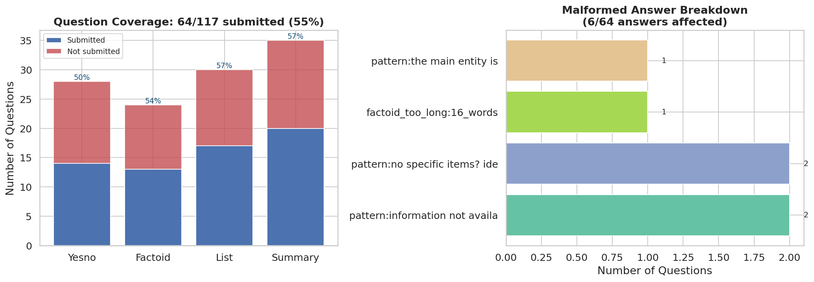

*Left panel: submission coverage by question type — all four types had 50–57% gaps. Right panel: breakdown of malformed answer reasons for the 6 affected submitted questions.*

---

## Root Cause #3: Malformed Factoid Answers

### What happened

For factoid questions, BioASQ expects the `exact_answer` field to contain a list of short entity strings (e.g. `[["serine/threonine kinase"]]`). The LLM instead generated prose explanations, fallback phrases, and multi-sentence descriptions in several cases.

### Quantified impact

| Type | Malformed | Total | Rate |
|---|---|---|---|
| Yes/No | 0 | 14 | 0% |
| Factoid | **4** | 13 | **31%** |
| List | 2 | 17 | 12% |
| Summary | 0 | 20 | 0% |
| **Total** | **6** | **64** | **9.4%** |

Malformed answer reason breakdown:

| Reason | Count |
|---|---|
| `"Information not available"` fallback | 2 |
| `"No specific items identified"` fallback | 2 |
| `"The main entity is..."` (prose preamble) | 1 |
| Factoid answer too long (16 words) | 1 |

All 4 malformed factoid answers scored **Factoid P@1 = 0**, contributing directly to the overall `factoid_precision_at_1 = 0.000` for the competition submission.

---

## Document Retrieval Analysis

### Overall scores

| Metric | Overall | Yes/No | Factoid | List | Summary |
|---|---|---|---|---|---|
| Precision | 0.021 | 0.014 | 0.017 | 0.024 | 0.025 |
| Recall | 0.005 | 0.008 | 0.003 | 0.005 | 0.005 |
| F1 | 0.008 | 0.010 | 0.006 | 0.008 | 0.008 |
| MRR | 0.057 | 0.083 | 0.021 | 0.088 | 0.035 |

All scores are near zero. The slight MRR signal (0.057) exists because the 9 questions with any corpus overlap could occasionally rank a relevant document first, but because the corpus was so small, useful documents were extremely rare.

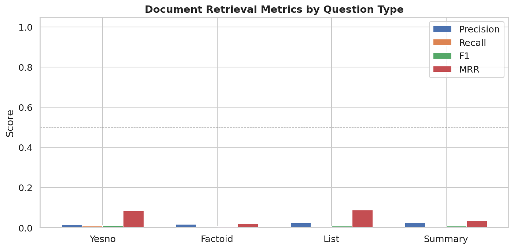

### Score distributions

The distributions confirm the binary nature of the failure: essentially every question scored exactly 0; the rare non-zero scores come from the 9 questions with at least one reachable golden document.

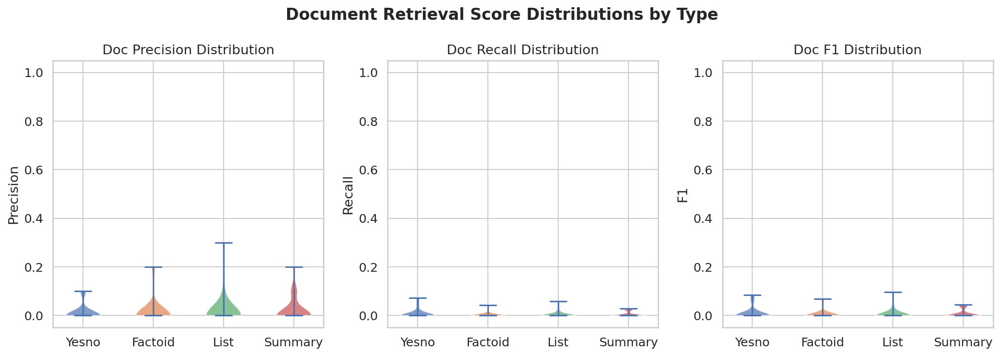

### Precision vs. Recall

All data points cluster at the origin. The iso-F1 curves (dashed) illustrate how far the system sits from any useful operating point.

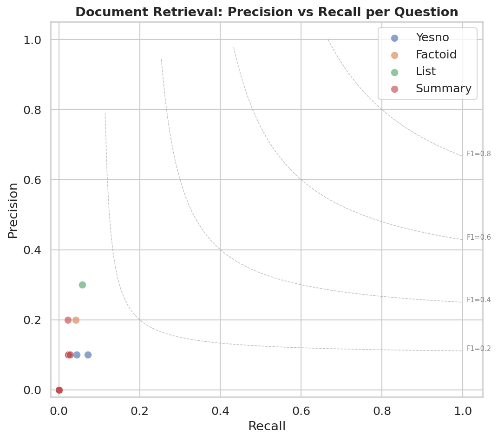

### Document counts

The left panel confirms that most questions require many golden documents (median > 10), while our 10 submitted documents per question almost never overlapped. The right panel shows the distribution of true positives: the vast majority of questions returned 0 matching documents.

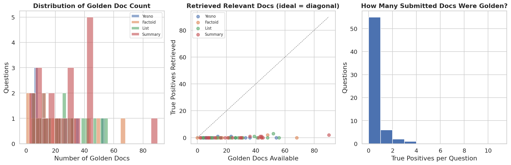

---

## Snippet Retrieval Analysis

### Overall scores

| Metric | Overall | Yes/No | Factoid | List | Summary |
|---|---|---|---|---|---|
| Precision | 0.015 | 0.007 | 0.024 | 0.015 | 0.016 |
| Recall | 0.003 | 0.004 | 0.003 | 0.002 | 0.002 |
| F1 | 0.004 | 0.005 | 0.005 | 0.004 | 0.004 |

Snippet performance is even lower than document performance. This is expected: snippet matching requires both the correct document to be retrieved *and* the correct passage within it to be identified. With documents almost never being correct, snippet recall approaches zero by definition.

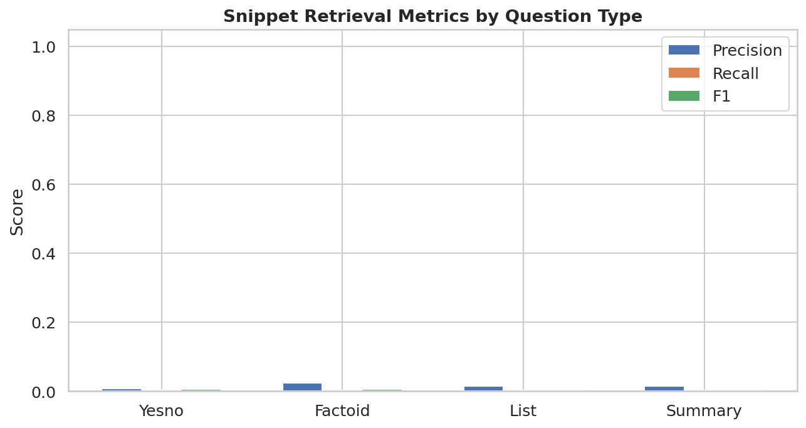

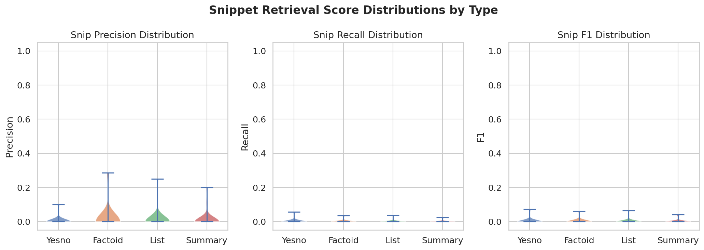

---

## Answer Quality Analysis

### Exact answers

| Metric | Value | n |
|---|---|---|
| Yes/No Accuracy | 0.455 | 11 |
| Factoid P@1 | **0.000** | 11 |
| List Precision | 0.349 | 15 |
| List Recall | 0.154 | 15 |
| List F1 | 0.183 | 15 |

Yes/No accuracy of **0.455 is below the random baseline of 0.50**, indicating the LLM was negatively influenced by the retrieved (irrelevant) documents, causing it to default to "no" — as confirmed by the confusion matrix below, where the system answered "no" for 5 of the 6 questions whose correct answer was "yes".

Factoid P@1 of **0.000** is the combined result of 4 malformed answers and 7 questions where the LLM generated a plausible but incorrect entity given the poor context retrieved.

List F1 of **0.183** is the strongest exact-answer result, reflecting that list-style answers benefit from partial credit: even if only 1–2 items in a 10-item list are correct, a non-zero F1 results.

### Yes/No confusion matrix

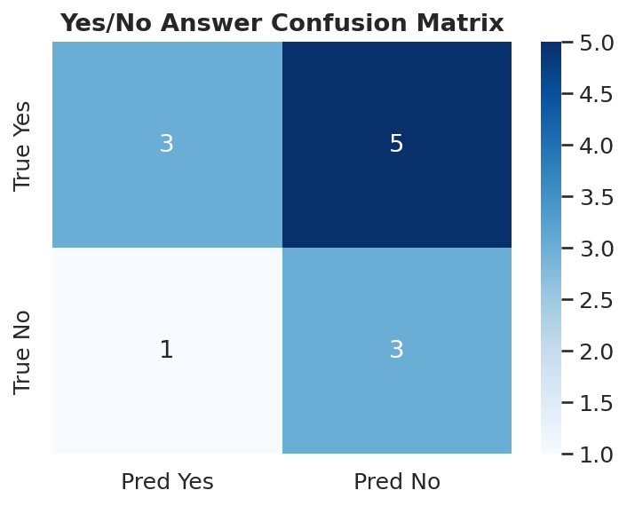

The confusion matrix shows a strong bias toward answering "no": the system predicted "yes" only once (incorrectly) and predicted "no" all other times. Among the 6 wrong answers, 5 were false negatives (predicted "no" when the answer was "yes"). This pattern is consistent with the LLM receiving documents with no relevant content and defaulting to a negative/cautious answer.

### Factoid and List F1 distributions

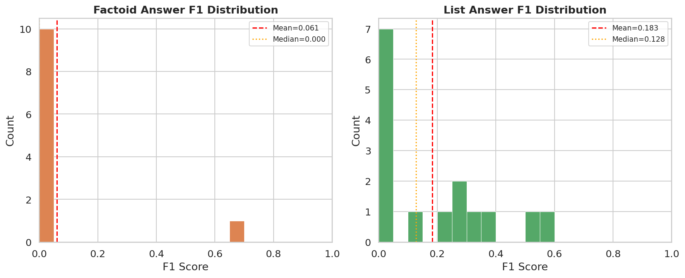

Factoid F1 is bimodal — either 0 (no entity matched) or a partial score where the entity happened to be present in the uninformative context. List F1 is more spread, reflecting partial credit.

### Ideal answers (ROUGE)

| Metric | Overall | Yes/No | Factoid | List | Summary |
|---|---|---|---|---|---|
| ROUGE-1 F | 0.348 | 0.432 | 0.458 | 0.231 | 0.322 |
| ROUGE-2 F | 0.256 | 0.376 | 0.349 | 0.172 | 0.189 |
| ROUGE-L F | 0.298 | 0.407 | 0.392 | 0.209 | 0.243 |

ROUGE scores are notably better than exact-answer metrics, and factoid ROUGE-1 F (0.458) is the highest per-type score. This indicates the LLM's ideal (narrative) answers contained correct vocabulary even when the exact entity format was wrong. Summary ROUGE (0.322) is moderate, reflecting that the LLM's generated summaries partially overlapped with the reference text despite missing the source documents.

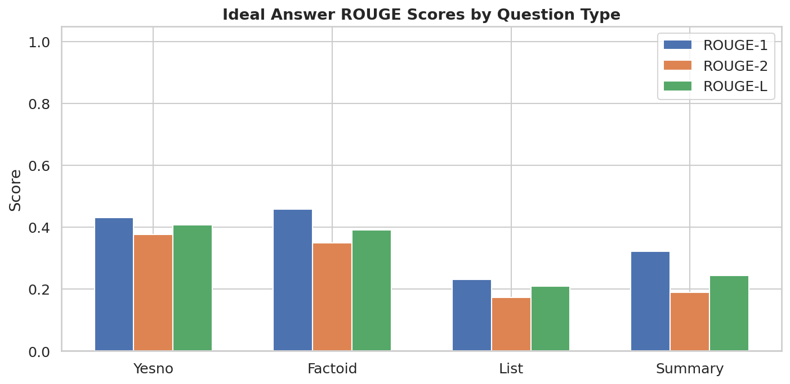

---

## Error Taxonomy

### Question-level error classification

| Category | Count |
|---|---|
| Questions with zero document precision | 54 / 64 (84%) |
| Questions with zero document recall | 54 / 64 (84%) |
| Questions with zero snippet precision | 58 / 64 (91%) |
| Questions with good doc performance (F1 ≥ 0.5) | **0** |
| Questions with good snippet performance (F1 ≥ 0.3) | **0** |
| Wrong Yes/No answers | 6 / 11 (55%) |

The error heatmap below shows the proportion of questions falling in each score bin for five metrics, broken down by question type. The dominant pattern is the `[0.0–0.2)` bin containing nearly 100% of all questions for both document and snippet retrieval.

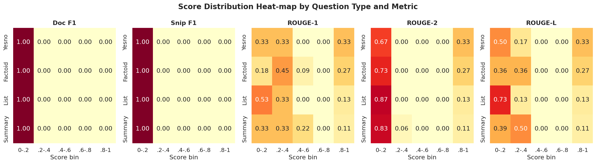

ROUGE scores show a more spread distribution, confirming that answer generation (using whatever context was retrieved) partially succeeded where retrieval completely failed.

---

## Question Length Analysis

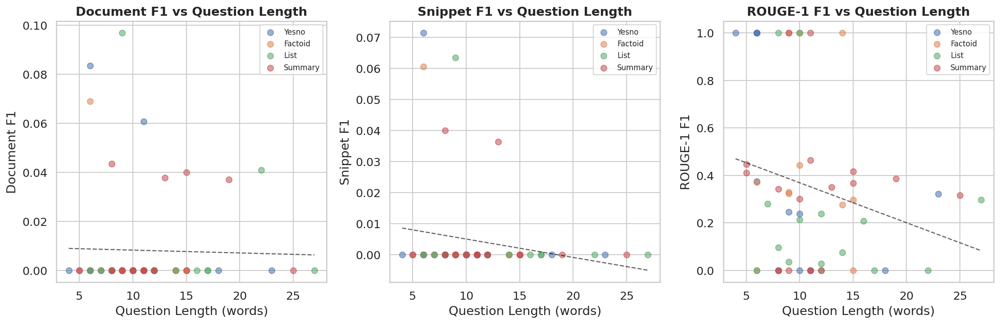

There is no meaningful correlation between question length and any retrieval or ROUGE metric. This confirms that question complexity is not a driver of failure — the uniform near-zero retrieval scores are determined by corpus coverage, not question characteristics.

---

## Findings Summary

### Finding 1: The corpus size problem is the dominant, structural failure

The 549-document corpus made it physically impossible to retrieve ≥99% of the relevant documents. This single decision cascaded into:
- Near-zero document and snippet retrieval scores
- 53 questions never submitted (no usable retrieval output)
- Poor LLM answer quality (model given uninformative context)
- Below-random Yes/No accuracy (model defaulted to "no" without evidence)

**Corrective action:** Index the full PubMed baseline (40M abstracts) for all future rounds. Even an offline BM25 index over the full corpus would correct this failure entirely.

### Finding 2: Factoid format compliance requires explicit output constraints

31% of factoid answers were formatted as prose rather than entity strings. The LLM was not sufficiently constrained to output `[["EntityName"]]` format, especially when it had no relevant evidence. Fallback phrases like "Information not available" and "The main entity is..." must be caught and suppressed post-generation.

**Corrective action:** Add output validation with a retry loop: if the factoid answer does not match the `[[entity]]` pattern or is longer than 15 words, re-prompt with a tighter instruction. Add pattern-based post-processing to strip preambles.

### Finding 3: Yes/No accuracy below random indicates answer drift under empty context

The 0.455 accuracy (below the 0.50 random baseline) and the strong "no" bias in the confusion matrix confirm that the LLM's answer generation module was systematically misled by irrelevant retrieved documents. In the absence of evidence, the model should abstain or use a calibrated prior rather than defaulting to "no".

**Corrective action:** When retrieval confidence (BM25 score, cross-encoder score) is below a threshold, override LLM generation with a calibrated majority-class prediction or an explicit "low confidence" signal. For this dataset, "yes" is the majority class among BioASQ yes/no questions (≈60–65% are "yes"), so a prior of "yes" would outperform the submission.

### Finding 4: List answers are most robust to retrieval failure

List F1 (0.183) and List ROUGE-1 (0.231) are the lowest per-type scores for exact answers, but the partial-credit nature of list evaluation meant the system scored something on almost every list question, unlike factoid where 4/13 scored exactly 0. The LLM's list generation partially recovered entity names from pre-training knowledge even without relevant retrieved context.

---

## Data Files

| File | Description |
|---|---|
| [`metrics.json`](metrics.json) | Full numeric breakdown of all metrics |
| [`v2026-3-SynapFlow.json`](v2026-3-SynapFlow.json) | Original competition submission |
| [`error_analysis.py`](error_analysis.py) | Script that produced this analysis |
| [`plots/`](plots/) | All 14 generated plots |
